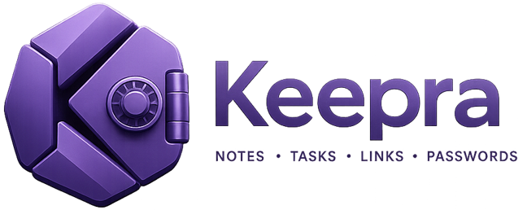
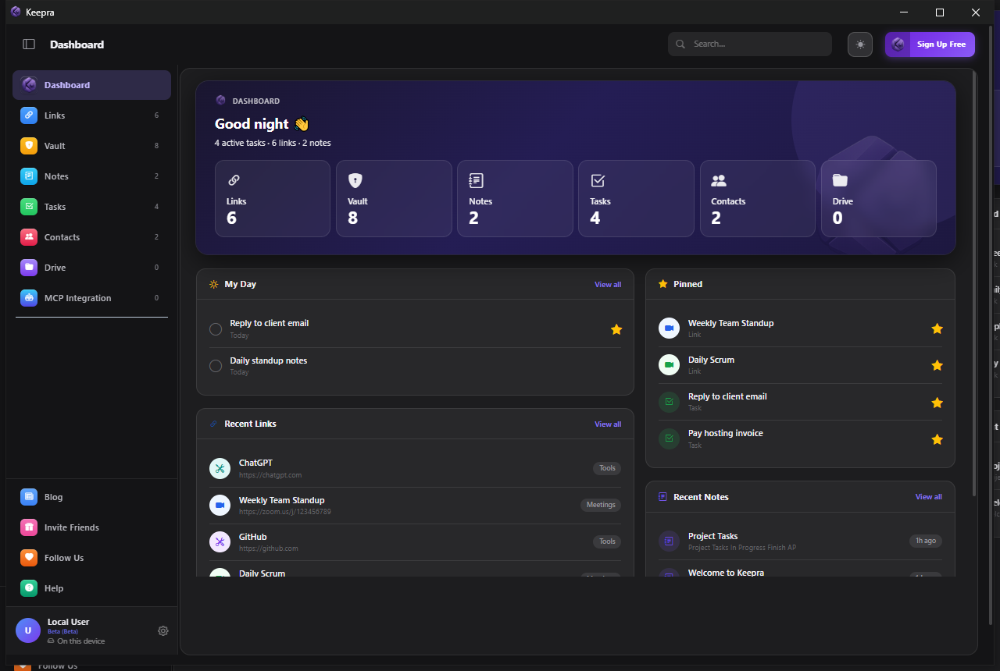
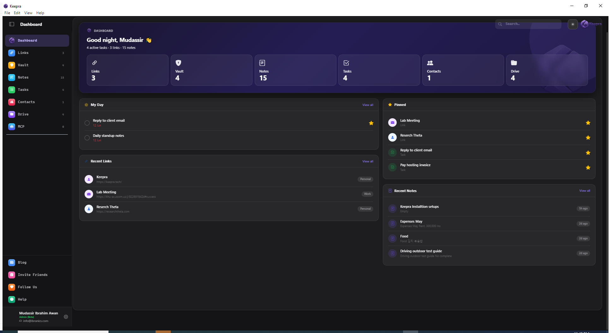
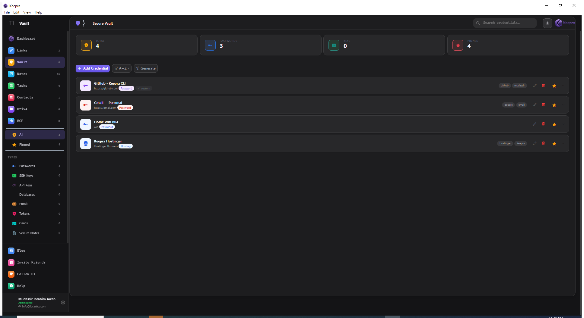
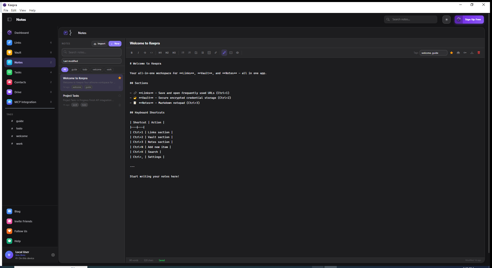
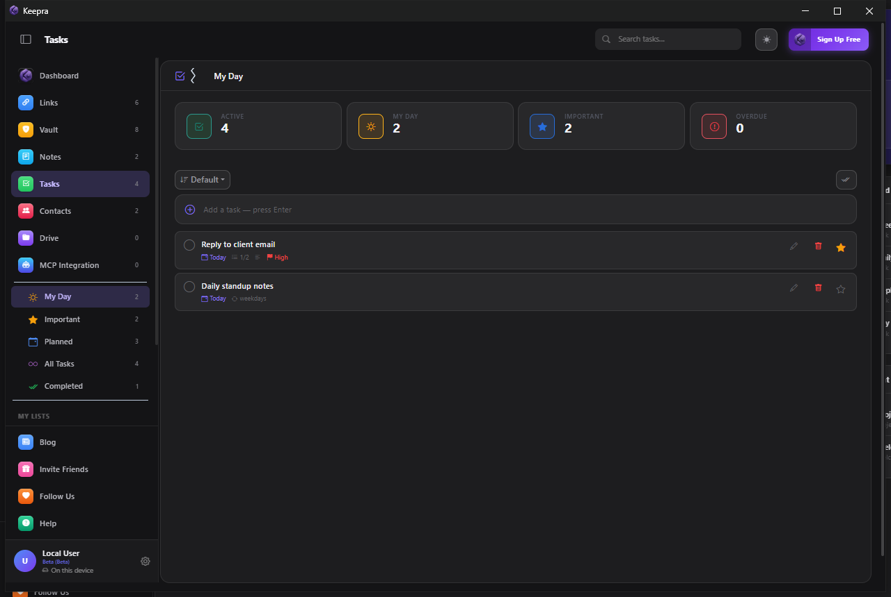
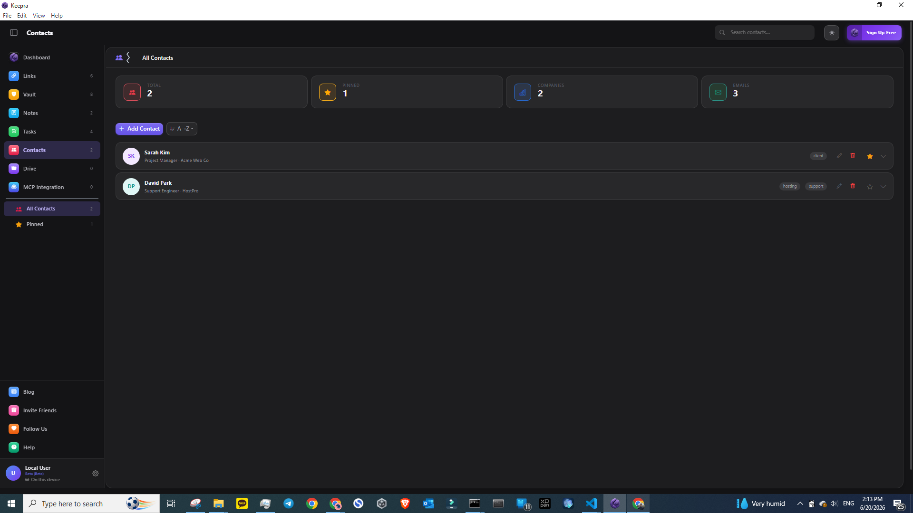
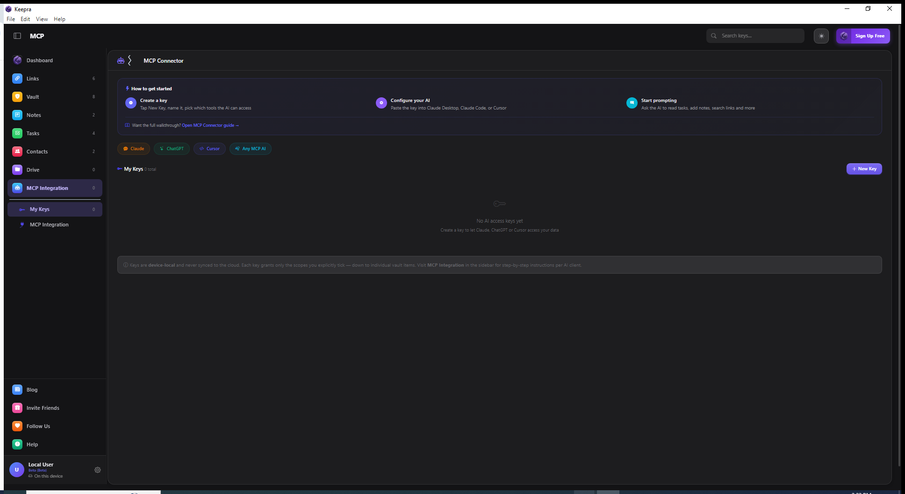
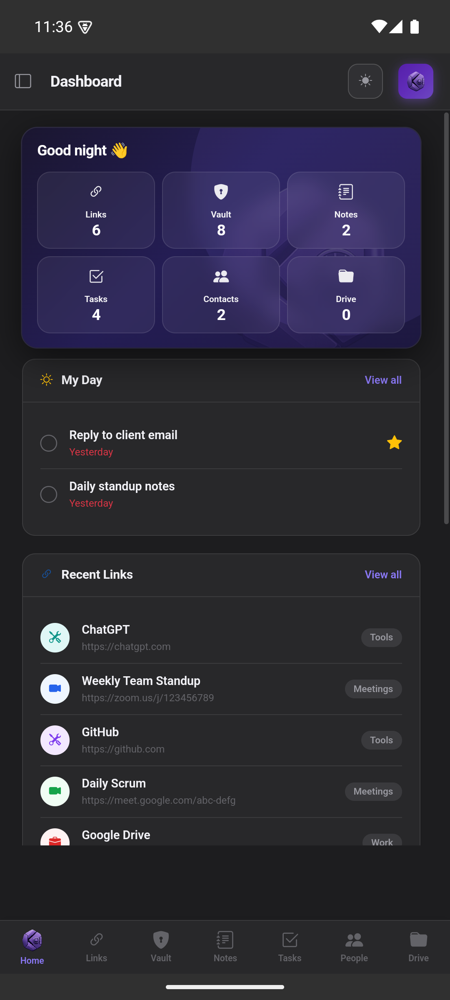

<p align="center">
  
</p>

<p align="center">
  <a href="https://keepra.tech/app.html"><strong>Open Web App</strong></a> &nbsp;&bull;&nbsp;
  <a href="https://github.com/mudassir-awan/keepra/releases/latest">Download for Windows or Android</a> &nbsp;&bull;&nbsp;
  <a href="https://github.com/mudassir-awan/keepra/issues">Report a Bug</a>
</p>

<p align="center">
  
  
  
  
  
</p>

---

**Keepra keeps your digital life in one private window.** It bundles seven everyday tools — a link manager, an AES-256 encrypted vault, a notepad, a task manager, a contacts directory, and a file drive — plus an **MCP Connector** that lets the AI assistant you already use (Claude, ChatGPT, Cursor, Windsurf, or any MCP-compatible client) work with your data through scoped, revocable, local-only access.

Everything is stored and encrypted **on your device** and works fully offline. Cloud sync is optional and **zero-knowledge** — the server only ever sees ciphertext. No account is required to start; one Secret Key links all your devices.

## Screenshots

<p align="center">
  
  <br />
  <em>Keepra Desktop — Links section (Windows)</em>
</p>

<table align="center">
  <tr>
    <td align="center"><br/><sub>Dashboard</sub></td>
    <td align="center"><br/><sub>Vault</sub></td>
    <td align="center"><br/><sub>Notes</sub></td>
  </tr>
  <tr>
    <td align="center"><br/><sub>Tasks</sub></td>
    <td align="center"><br/><sub>Contacts</sub></td>
    <td align="center"><br/><sub>MCP Connector</sub></td>
  </tr>
</table>

<p align="center">
  
  <br />
  <em>Keepra on Android</em>
</p>

See the **[full visual guide with screenshots of every section](docs/GUIDE.md)**, including how to set up the MCP Connector.

## What's inside

| Tool | What it does |
|------|-------------|
| 🏠 Dashboard | Your home view — stat tiles plus My Day, Recent Links, Pinned items, and Recent Notes. A read-only snapshot that pulls everything together. |
| 🔗 Links | Save and one-click-open any URL — Zoom, Meet, and Teams meeting links, work tools, anything. Organize with categories, tags, pinning, and grid or list views. |
| 🔐 Vault | A zero-knowledge store for passwords, API keys, SSH keys, database credentials, cards, and secure notes. Encrypted with AES-256-GCM; your master password never leaves your device. |
| 📝 Notes | A distraction-free notepad with live preview, split view, tags, and auto-save. Works fully offline. |
| ✅ Tasks | A focused task manager with My Day, Important, and Planned smart lists, custom lists, subtasks, priorities, due dates, and recurring tasks. |
| 👥 Contacts | A personal people directory. Each contact holds unlimited phone numbers, emails, and links, each with its own custom label. |
| 📁 Drive | 50 MB of encrypted file storage for images, PDFs, and archives. Files live in IndexedDB on-device and sync as ciphertext — never plaintext. |
| 🤖 MCP Connector | Give Claude, ChatGPT, Cursor, Windsurf, or any MCP client scoped, local-only access to your tasks, notes, links, and contacts — with optional per-item access to individual vault entries. Keys are device-local and never touch the cloud. |

## Download

| Platform | Where to get it | Notes |
|----------|----------------|-------|
| Web (PWA) | [keepra.tech/app.html](https://keepra.tech/app.html) | Runs in any browser. Install to your home screen for offline use. |
| Windows | [Download .exe](https://github.com/mudassir-awan/keepra/releases/latest/download/Keepra-Setup.exe) | Electron desktop app. Windows 10 and above. |
| Android | [Download .apk](https://github.com/mudassir-awan/keepra/releases/latest/download/Keepra.apk) | Direct APK. Play Store listing coming soon. |
| iOS / macOS | Coming soon | — |

> The installers are not yet code-signed, so Windows SmartScreen ("Windows protected your PC") and Android ("this file may harm your device") will warn you on first run. Choose **More info → Run anyway** / **Download anyway** — it's safe. See [docs/INSTALL.md](docs/INSTALL.md) for step-by-step help.

All features are free during the public beta, and you can use the app locally with no account at all.

## How the encryption works

Every item in the Vault is encrypted with **AES-256-GCM**. The key is derived from your master password using **PBKDF2 (SHA-256, 600,000 iterations)**. Your password is never stored anywhere — not on a server, not even on your own device. It exists only in memory while the app is open.

When you turn on cloud sync, Keepra derives both a Firebase account and an encryption key from a single **Secret Key** that only you hold. The server receives nothing but base64-encoded ciphertext, so neither Keepra, nor Firebase, nor anyone else can read your data without that key.

## Sync across devices

1. Open **Settings → Sync & Devices**
2. Create a vault to generate your **Secret Key**
3. On another device, enter the same Secret Key — or scan the QR code shown on the first device

That's it. No email, no separate password, no registration.

## Connect your AI assistant (MCP)

Keepra ships an [MCP](https://modelcontextprotocol.io) server so the AI you already use can read and write your tasks, notes, links, and contacts — **safely and on your terms**. It works with **Claude (Desktop & Code), ChatGPT, Cursor, Windsurf, and any MCP-compatible client.** Each connection uses a scoped API key you create inside the app, and you decide exactly which tools (and which individual vault items) the AI may touch. Keys are device-local and revocable at any time.

**Prerequisites:** the Keepra desktop app running, plus [Node.js](https://nodejs.org/en/download) installed (clients launch the server with `node keepra-mcp.js`).

**In-app setup:** open Keepra → **Settings → MCP → MCP Integration** for a guided, copy-paste walkthrough.

Quick config (Claude Desktop, Cursor, Windsurf, and most clients use this same shape — replace `YOUR_KEY_HERE` with the key you create in the app):

```json
{
  "mcpServers": {
    "keepra": {
      "command": "node",
      "args": ["C:\\Keepra\\keepra-mcp.js"],
      "env": {
        "KEEPRA_KEY": "YOUR_KEY_HERE",
        "KEEPRA_URL": "http://127.0.0.1:47615"
      }
    }
  }
}
```

Full multi-client guide (Claude Desktop, Claude Code, ChatGPT, Cursor, Windsurf, and others): **[docs/MCP-SETUP.md](docs/MCP-SETUP.md)**

## Frequently asked questions

**Is Keepra free?**
Yes — every feature is free during the public beta (2026). Paid plans are planned for around Q4 2026, and beta users get a promo code that locks in early-adopter pricing.

**Does Keepra send my data to a server?**
No. Your data lives on your device. If you enable sync, only encrypted ciphertext is stored in Firestore — the server never sees plaintext.

**Can I use Keepra without an account?**
Yes. Local use needs no account at all. Sync needs only a Secret Key — no email, no password.

**Which AI assistants can connect?**
Any assistant that speaks the Model Context Protocol — including Claude (Desktop and Code), ChatGPT, Cursor, and Windsurf. You stay in control of exactly what each one can access.

**What platforms are supported?**
Web (any browser, installable as a PWA), Windows 10 and above, and Android. iOS and macOS are planned.

**Is the source code open?**
No — the app is proprietary. This repository is the public community hub for bug reports, feature requests, and documentation.

**What encryption does Keepra use?**
AES-256-GCM for data at rest, with keys derived via PBKDF2 (SHA-256, 600,000 iterations). The master key is never stored.

## Roadmap

| Feature | Status |
|---------|--------|
| Web PWA | Done |
| Windows desktop (Electron) | Done |
| Android APK | Done |
| MCP integration (Claude, ChatGPT, Cursor, Windsurf, …) | Done |
| Zero-knowledge cross-device sync | Done |
| QR-code device linking | Done |
| Automatic update notifications | Done |
| Play Store listing | In progress |
| Code-signed installers | Planned |
| macOS and iOS | Planned |
| Biometric unlock | Planned |
| Paid plans | Q4 2026 |

Full roadmap: [docs/ROADMAP.md](docs/ROADMAP.md)

## For developers

Keepra is a single-page app with no build step — plain HTML, CSS, and vanilla JavaScript with jQuery.

- `app.html` — unified shell with all the tools
- `app-logic.js` — all application logic (vanilla JS + jQuery)
- `app.css` — design system with CSS variables and dark/light themes
- `sync.js` — zero-knowledge cloud sync (Firebase)
- `keepra-mcp.js` — MCP stdio server for AI-client integration
- `electron.js` — Electron wrapper with an embedded HTTP server

The same codebase ships to three targets. **Web:** serve `app.html` over HTTP. **Desktop:** Electron copies the files to `C:\Keepra\` and serves them over `http://localhost`. **Android:** Capacitor wraps the HTML and JS into a native APK.

Architecture detail: [docs/ARCHITECTURE.md](docs/ARCHITECTURE.md)

## Issues and feedback

This repository is the public community hub. The app itself is proprietary.

- [Report a bug](https://github.com/mudassir-awan/keepra/issues/new?template=bug_report.md)
- [Request a feature](https://github.com/mudassir-awan/keepra/issues/new?template=feature_request.md)
- [Ask a question](https://github.com/mudassir-awan/keepra/issues/new?template=question.md)

## Security

For security vulnerabilities, please email **support@keepra.tech** rather than opening a public issue.

See [SECURITY.md](SECURITY.md) for the full policy and encryption model.

## License

Keepra is proprietary software, free for personal use. See [LICENSE](LICENSE).

© 2026 Keepra / IBRANICS — [keepra.tech](https://keepra.tech)
