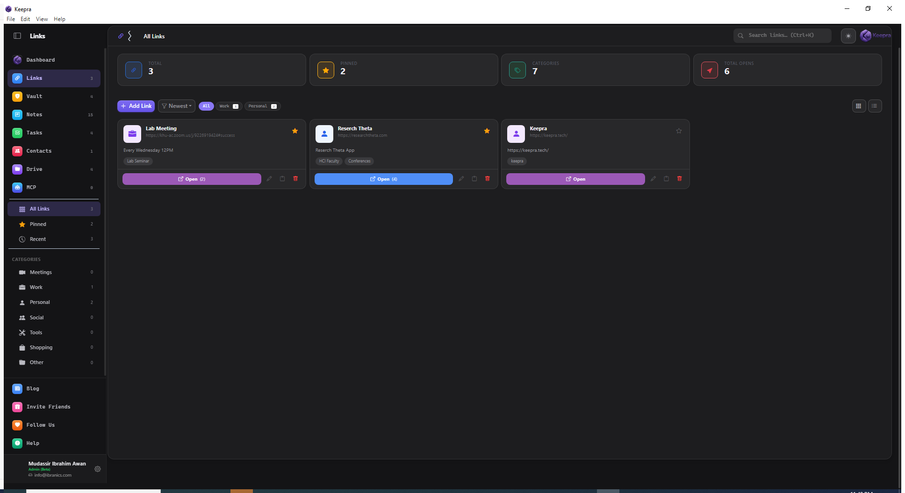
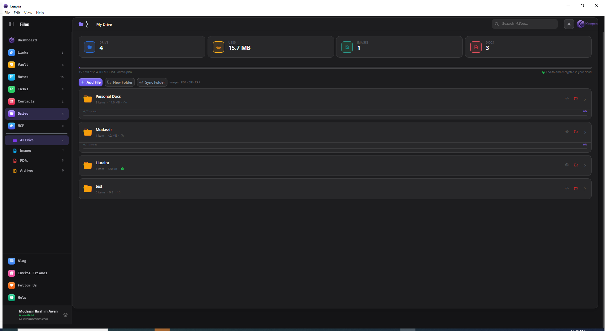
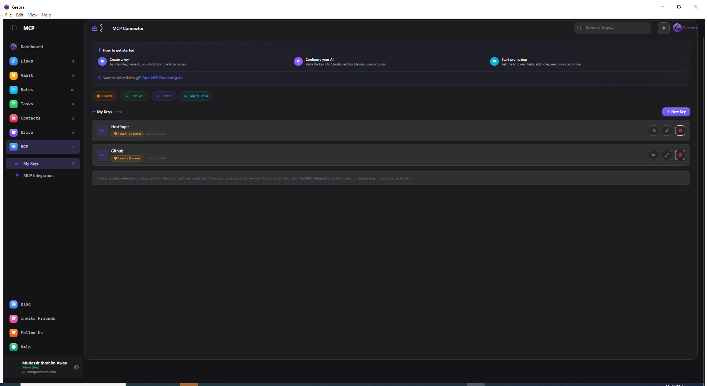
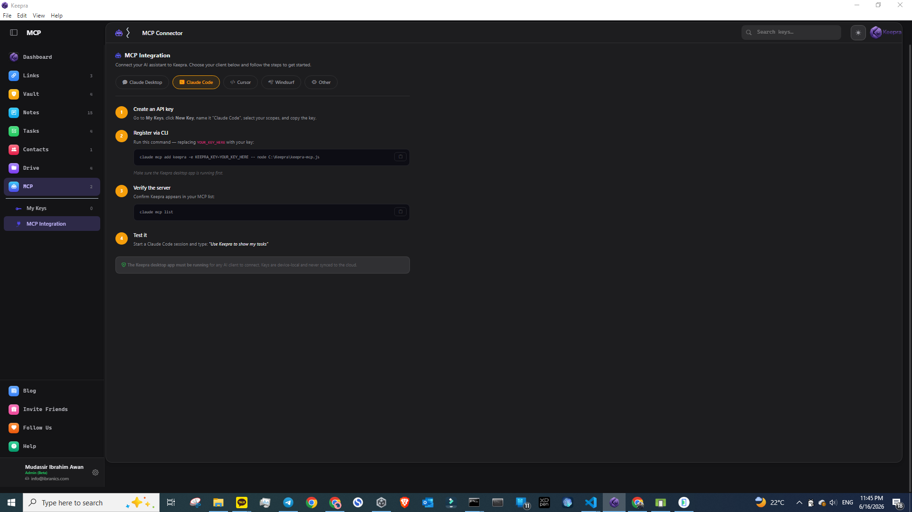

# Keepra Visual Guide

A walkthrough of every section in Keepra with screenshots from the desktop app.

---

## Dashboard


The Dashboard is your home screen. It shows a live overview of everything in your Keepra:

- **Stat tiles** at the top show counts for Links, Vault, Notes, Tasks, Contacts, and Drive
- **My Day** shows tasks you added to today's focus list
- **Pinned** shows your starred items across all tools
- **Recent Links** shows the last links you opened
- **Recent Notes** shows notes you recently edited

The Dashboard is read-only. Click "View all" on any widget to jump to that tool.

---

## Links



The Links section is a bookmark manager built for people who deal with lots of URLs: Zoom meetings, work tools, dashboards, client sites, documentation.

**What you can do:**
- Save any URL with a title, description, and tags
- One-click open with the **Open** button (tracks how many times you opened it)
- Pin links to keep them at the top
- Filter by category (Work, Personal, Meetings, Tools, etc.)
- Switch between grid and list view
- Search links by title, URL, or tag

**How to add a link:**
1. Click **+ Add Link**
2. Paste the URL — Keepra auto-fills the title and icon
3. Add a category and optional tags
4. Click Save

---

## Vault


The Vault stores everything sensitive: passwords, API keys, SSH keys, database credentials, email accounts, tokens, cards, and secure notes. All items are encrypted with AES-256-GCM before being saved.

**What you can do:**
- Add credentials by type: Password, SSH Key, API Key, Database, Email, Token, Card, Secure Note
- Each item stores a title, URL, username, password/key, and custom fields
- Generate strong passwords with the **Generate** button
- Filter by type in the sidebar (Passwords, SSH Keys, API Keys, etc.)
- Pin frequently used items
- Search across all vault items

**Security:**
Your master password is never stored. It is derived into an encryption key in memory only. Even if someone got your device's storage, they cannot read the vault without your password.

---

## Notes


Notes is a Markdown notepad. Write anything from quick reminders to structured documents. Notes auto-save as you type.

**What you can do:**
- Write in Markdown with a full toolbar (bold, italic, code, headers, lists, links, tables)
- See a live preview split-screen while you write
- Tag notes for organization
- Pin important notes
- Search notes by title or content
- Import Markdown files

**Markdown toolbar:**
The toolbar at the top of the editor covers the most common formatting: B, I, strikethrough, inline code, H1/H2/H3, ordered list, unordered list, checklist, horizontal rule, link, and table.

---

## Tasks


Tasks is a to-do manager similar to Microsoft To Do. It has smart lists and custom lists.

**Smart lists (left sidebar):**
- **My Day** - tasks you want to focus on today
- **Important** - tasks you starred
- **Planned** - tasks with a due date
- **All Tasks** - every task in one view
- **Completed** - finished tasks

**Custom lists:**
Create your own lists (Work, Personal, Shopping, etc.) with the **+ New list** button.

**Task features:**
- Add subtasks/steps to any task
- Set a due date and recurrence (daily, weekly, monthly, yearly)
- Mark as important (star)
- Add to My Day
- Set priority: High, Medium, Low
- Quick-add a task by typing in the input at the top and pressing Enter

---

## Contacts


Contacts is a personal directory for the people you work or communicate with.

**What you can do:**
- Add a contact with name, company, role, and notes
- Add unlimited phone numbers, emails, and links per contact — each with a label (Mobile, Work, Business, Portfolio, etc.)
- Tag contacts for grouping
- Pin contacts
- Search by name, company, or tag

Each contact row expands to show all their details. Contacts are cloud-synced and also accessible via the MCP API.

---

## Drive



Drive stores important files: images, PDFs, ZIPs, and RARs. The quota is 50 MB. Files are stored in IndexedDB locally and synced to the cloud as encrypted chunks.

**What you can do:**
- Upload files by clicking **+ Add File** or by dragging and dropping onto the Drive area
- Create folders to organize files
- Create subfolders inside folders
- View images and PDFs directly in the app (no download needed)
- Download files to your device
- Upload files to your encrypted cloud for cross-device access

**Supported file types:** PNG, JPG, GIF, WebP, SVG, PDF, ZIP, RAR

**Note:** The 50 MB quota applies to the total size of all files. Encrypted cloud sync is included — files are never stored in plaintext on the server.

---

## MCP Connector



The MCP Connector lets you connect AI assistants (Claude, ChatGPT, Cursor, Windsurf) to your Keepra data. Each connection uses a scoped API key that you control.

### How it works

1. You create a key in Keepra and choose exactly what the AI can access (tasks, notes, links, contacts, or specific vault items)
2. You paste the key into your AI client's config
3. The AI can then read and write your Keepra data — but only within the scopes you allowed
4. Keys never leave your device and are never synced to the cloud

### Step 1 - Create a key

Click **+ New Key**, give it a name (e.g. "Claude Desktop"), then pick the tools and vault items the AI should have access to. Click Save, then click the eye icon to reveal and copy the key.

### Step 2 - Configure your AI client

Follow the guide for your client below.

---

## MCP Integration Guide


### Claude Desktop

1. Open or create `%APPDATA%\Claude\claude_desktop_config.json`
2. Add the Keepra MCP server:

```json
{
  "mcpServers": {
    "keepra": {
      "command": "node",
      "args": ["C:\\Keepra\\keepra-mcp.js"],
      "env": {
        "KEEPRA_KEY": "YOUR_KEY_HERE"
      }
    }
  }
}
```

3. Replace `YOUR_KEY_HERE` with the key you copied in Step 1
4. Fully quit Claude Desktop (system tray) and relaunch it
5. Test: type "List my Keepra tasks" in Claude

---

### Claude Code



Run this command in your terminal (replace the key):

```bash
claude mcp add keepra -e KEEPRA_KEY=YOUR_KEY_HERE -- node C:\Keepra\keepra-mcp.js
```

Or add it to your project's `.claude/settings.json`:

```json
{
  "mcpServers": {
    "keepra": {
      "command": "node",
      "args": ["C:\\Keepra\\keepra-mcp.js"],
      "env": {
        "KEEPRA_KEY": "YOUR_KEY_HERE"
      }
    }
  }
}
```

---

### Cursor

1. Open Cursor Settings (Ctrl+Shift+J)
2. Go to **MCP** tab
3. Click **+ Add MCP Server**
4. Paste this config:

```json
{
  "keepra": {
    "command": "node",
    "args": ["C:\\Keepra\\keepra-mcp.js"],
    "env": {
      "KEEPRA_KEY": "YOUR_KEY_HERE"
    }
  }
}
```

---

### Windsurf

1. Open Windsurf Settings
2. Navigate to **Cascade > MCP Servers**
3. Click **Add Server** and paste:

```json
{
  "keepra": {
    "command": "node",
    "args": ["C:\\Keepra\\keepra-mcp.js"],
    "env": {
      "KEEPRA_KEY": "YOUR_KEY_HERE"
    }
  }
}
```

---

### What the AI can do with Keepra

Once connected, you can prompt your AI assistant to:

**Tasks:**
- "Add a task to call the client tomorrow at 3pm"
- "Show me all my overdue tasks"
- "Mark the standup task as complete"
- "What is on my My Day list?"

**Notes:**
- "Create a note called Meeting Summary with the following content..."
- "Search my notes for anything about the project deadline"
- "Show me my pinned notes"

**Links:**
- "Save this URL as a link titled 'New Dashboard'"
- "Find my Zoom links"
- "Open all links tagged with 'work'"

**Contacts:**
- "Find the contact for David"
- "Add a new contact: Jane Smith, Designer at Acme"
- "What is the email for the HostPro support engineer?"

**Vault (scoped items only):**
- The AI can reference specific vault items you explicitly granted access to
- The AI never sees raw credentials — values are injected by Keepra at call time
- Use this for automating deployments, GitHub actions, or server tasks without hardcoding secrets

---

## Keyboard Shortcuts

| Shortcut | Action |
|----------|--------|
| Ctrl+1 | Dashboard |
| Ctrl+2 | Links |
| Ctrl+3 | Vault |
| Ctrl+4 | Notes |
| Ctrl+5 | Tasks |
| Ctrl+6 | Contacts |
| Ctrl+7 | Drive |
| Ctrl+8 | MCP |
| Ctrl+K | Global search |
| Ctrl+N | New item (context-aware) |

---

[Back to main README](../README.md)
